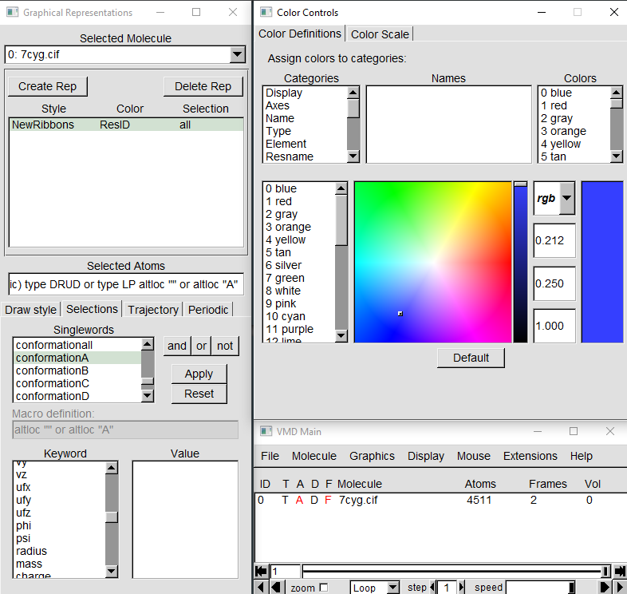

# lab5

* Was used **VMD** program for visualization

* The following protein structure was used for visualization: https://www.rcsb.org/structure/7CYG

### VMD GUI interface 

1. You can change coloring and drawing method.
2. Change specific sliders for any coloring method.
3. Open `Selections` tab to change atomic selection
4. Define any colors in `Color Definitions` 

### Result images

Result images are placed in `./images` folder